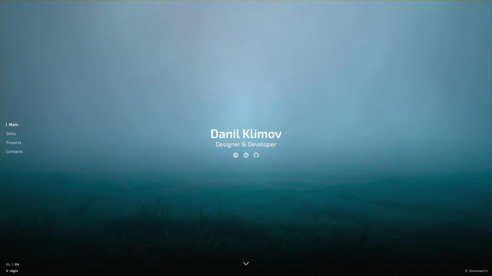
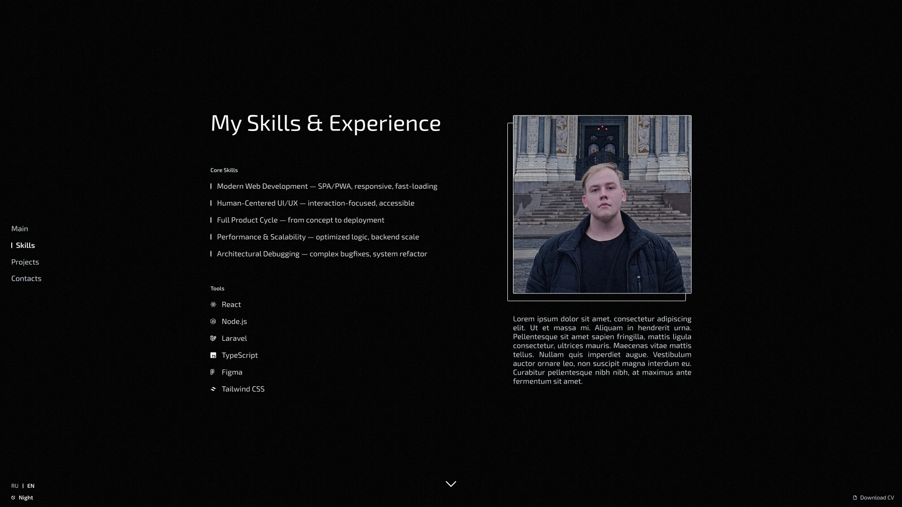
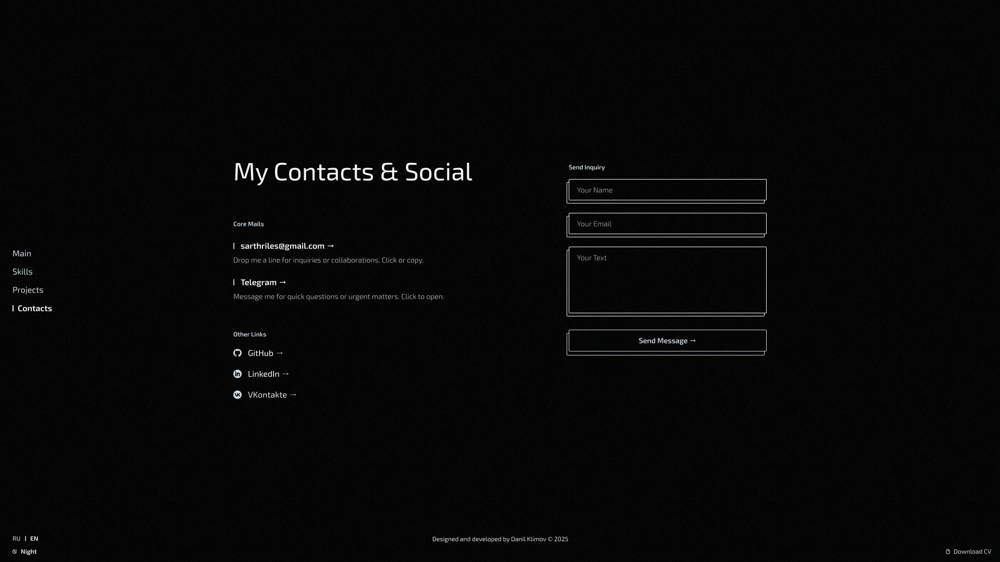
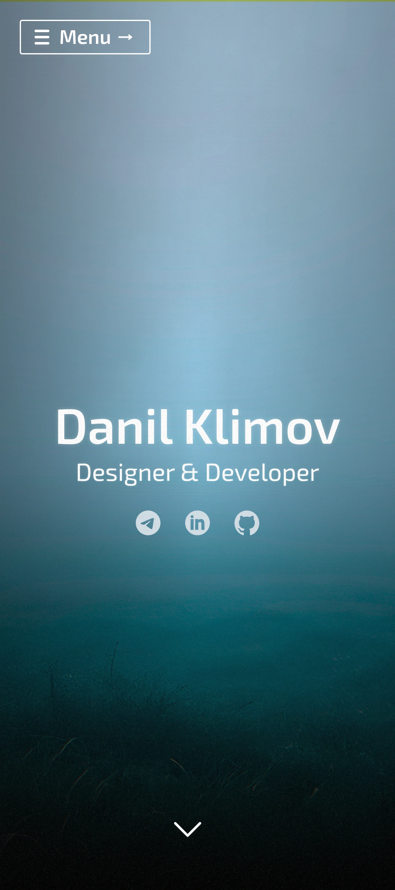
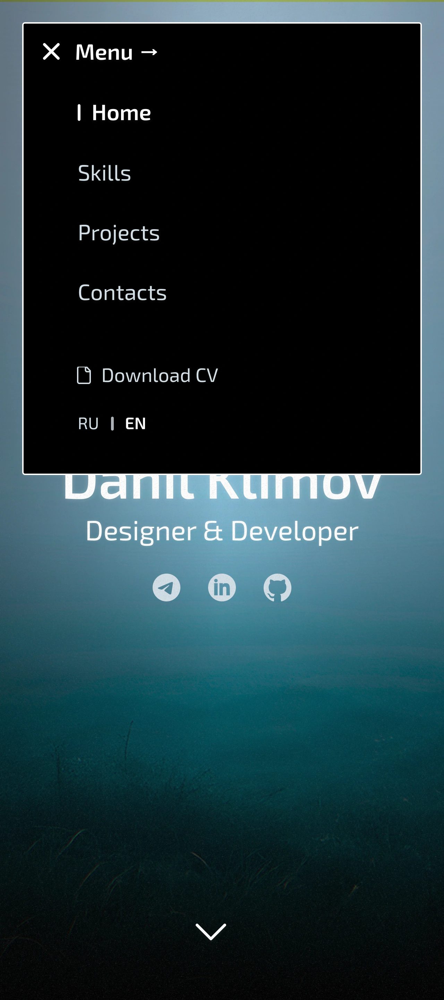

# Personal Portfolio (Archived Project)

A Highly Interactive Client-Side SPA Application

---

## Overview

This repository contains the code for an interactive and performance-optimized personal portfolio, serving as a demonstration of my frontend development skills. It's an archival project that showcases my approach to building dynamic, adaptive, and visually engaging web applications, with a focus on user experience and clean code architecture.

The project features a **dynamic multi-architecture design**: upon loading, it intelligently detects the user's device type (mobile or desktop) and dynamically loads the appropriate set of TypeScript modules and CSS styles.

* The **desktop version** is implemented as a Single-Page Application (SPA) with custom routing, meticulously recreating an interactive presentation. It features full interception and control over mouse scroll behavior, enabling "slide-like" page transitions instead of traditional scrolling, alongside parallax effects for a truly unique user experience.
* The **mobile version** is a lightweight landing page, optimized for seamless interaction on touch-enabled devices.

Furthermore, the application incorporates a **custom localization system** (Russian/English), dynamically loading specific HTML layouts and content pages for each language and device, ensuring full content and interface adaptation. Intensive visual effects and animations are powered by **GSAP**, while the entire project is built with **TypeScript**, emphasizing modularity and performance optimization. Contact form integration is handled via Google Apps Script for robust backend connectivity.

This project embodies my commitment to turning complex design concepts into working, performant, and user-centric web products.

---

## Features

This portfolio application showcases a range of advanced frontend capabilities and innovative design patterns:

* **Dynamic Multi-Architecture & Device Detection:**
    * Automatically detects desktop or mobile environments.
    * Dynamically loads separate JavaScript bundles (e.g., `desktop-app-bootstrap.ts`, `mobile-app-bootstrap.ts`) and CSS (e.g., `desktop.css`, `base.css` + mobile-specific styles) tailored for optimal performance and UI/UX on each device type.
* **Custom SPA Routing (Desktop):**
    * Implements a bespoke routing system controlled primarily by `PageManager.ts`. This system fully intercepts and manages mouse scroll events, providing fluid, interactive "slideshow-like" page transitions instead of traditional scrolling.
    * This creates a more engaging and unconventional presentation flow, moving beyond standard browser navigation.
* **Lightweight Mobile Landing Page:**
    * Optimized for touch interactions with a streamlined design (`MobileNavigationManager.ts`).
    * Ensures fast loading and responsive performance on mobile devices.
* **Advanced Localization System:**
    * Features a custom-built solution (`LanguageSwitcherManager.ts`, `languageDetector.ts`).
    * Dynamically loads language-specific HTML layouts (`/src/layouts/en/`, `/src/layouts/ru/`) and content pages (`/src/pages/en/`, `/src/pages/ru/`) based on user preferences or detected browser language.
    * Ensures full content adaptation for both Russian and English versions.
* **Rich Visual Effects & Animations:**
    * Extensive use of **GSAP (GreenSock Animation Platform)** for smooth, performant, and engaging UI animations.
    * Includes dynamic hero section animations (`HeroManager.ts`), interactive project listings (`ProjectItemManager.ts`), a captivating background fog effect (`fogEffect.css`, `ParallaxManager.ts`) and other.
* **Modular TypeScript Architecture:**
    * Built entirely with TypeScript for robust type safety, improved code maintainability, and enhanced developer experience.
    * Organized into distinct modules and managers (e.g., `MenuManager.ts`, `FormManager.ts`) to promote reusability and clarity.
* **Interactive Contact Form:**
    * Integrates a fully functional contact form, leveraging **Google Apps Script** for serverless backend processing.
    * Provides a reliable method for visitors to connect.
* **Optimized Assets:**
    * Utilizes modern image formats (e.g., `.webp` for fog images) and `transform: translate3d` for animations to ensure high performance and smooth rendering.
    * CSS is minified and optimized, with vendor prefixes intelligently handled.

---

## Technologies Used

This project is built using a modern and efficient tech stack:

### Frontend:

* **TypeScript:** For building a robust and maintainable codebase with strong typing.
* **Tailwind CSS:** For a utility-first approach to styling, ensuring a clean, modern, and highly responsive design across all devices.
* **GSAP (GreenSock Animation Platform):** The industry-standard library for professional-grade web animations, used for all major UI/UX interactions and visual effects.
* **Vite:** As a lightning-fast build tool, providing a rapid development experience and optimized production builds.

### Backend/API:

* **Google Apps Script:** For handling server-side logic related to contact form submissions, demonstrating serverless integration capabilities.

---

## Code Highlights

Reviewing the codebase demonstrates key implementation patterns and architectural decisions:

* **`main.ts`:** This file serves as the central orchestration point, handling core dynamic resources (like API endpoints for Google Apps Script) and managing the initialization and overall flow of the application based on device detection.
* **`PageManager.ts` (Desktop):** As the primary controller for the desktop version, this script manages all page transitions, including slide-like effects, and orchestrates the activation/deactivation of other managers (like `ParallaxManager`, `ProjectItemManager`, `HeroManager`, `FormManager`) for specific page behaviors.
* **`NavigationManager.ts` (Desktop) & `MobileNavigationManager.ts`:** These managers are responsible for controlling the state and interactions of navigation buttons, ensuring a smooth user interface for moving between sections.
* **`*-app-bootstrap.ts`:** These files (e.g., `desktop-app-bootstrap.ts`, `mobile-app-bootstrap.ts`) are responsible for the initial setup and loading of the appropriate application environment and its core managers based on device type.
* **`/src/layouts/` and `/src/pages/` directories:** Illustrate the modular approach to localization and dynamic content loading based on detected language and device type.
* **`ProjectItemManager.ts`:** Provides an example of complex interactive component management, including GSAP animations for hover and active states within a dynamic list.
* **`fogEffect.css`:** Demonstrates advanced CSS animations and optimization techniques (like `transform: translate3d`) for smooth visual effects.
* **`FormManager.ts`:** Shows client-side form validation and its integration with a Google Apps Script endpoint, as initiated and configured from `main.ts`.
* **`HeroManager.ts`:** Highlights the implementation of a custom interactive hero section with dynamic content and animations.

---

## Screenshots

To fully appreciate the design and interactive elements, here are the key sections you should capture:

### Desktop Screenshots:






---

### Mobile Screenshots:

<p align="center">
  
  
</p>

---

## Project Status & Insights

This project is now considered **archived** and is primarily maintained for portfolio demonstration purposes. It represents a completed phase of development, showcasing a particular set of skills and architectural choices at the time of its creation. While active feature development is not planned, this repository remains a valuable resource for understanding the implementation patterns and solutions employed within its scope.

---

## Setup

To set up and run this project locally:

1.  **Clone the repository:**
    ```bash
    git clone https://github.com/saakivnzechad/personal-portfolio-archived.git
    cd personal-portfolio-archived
    ```
2.  **Install Node.js and npm/yarn/pnpm** (if you don't have them).
3.  **Install frontend dependencies:**
    ```bash
    npm install   # or yarn install, pnpm install
    ```
4.  **Run the development server:**
    ```bash
    npm run dev
    ```
    This will typically start a local server at `http://localhost:5173` (or similar).
5.  **Build the production version (optional):**
    ```bash
    npm run build
    ```
    This will generate the `dist` directory with optimized static assets.
6.  **For Contact Form Functionality:**
    * You will need to set up a Google Apps Script linked to a Google Sheet to handle form submissions. The `FormManager.ts` is configured to interact with a specific Google Apps Script web app URL.
    * You'll need to create your own script and deploy it as a web app, then update the `FORM_URL` constant within your `main.ts` file (or an environment variable if you set one up) to point to your deployed script's URL.

---

## Author

**Danil Klimov**
* GitHub: [@saakivnzechad](https://github.com/saakivnzechad)
* Telegram: [@sarthriles](https://t.me/sarthriles)

---

## License

This project is licensed under the **Mozilla Public License Version 2.0 (MPL 2.0)**.
A copy of the license is available in the `LICENSE` file in this repository.

---

## Credits

The background fog animation (`src/components/fogEffect.css` and `/public/images/fog1.webp`, `/public/images/fog2.webp`) is based on the work by [danielstuart14](https://github.com/danielstuart14/CSS_FOG_ANIMATION). It has been heavily modified and optimized for this project.
